# MSA-Grok E-commerce 微服务架构演示项目蓝图

## 项目概述

**MSA-Grok E-commerce** 是一个完整的微服务架构电商演示项目，使用 TypeScript 实现，旨在展示现代电商系统的微服务架构模式，包含完整的前后端分离设计。

## 系统架构图

```mermaid
graph TB
    %% 前端层
    subgraph "前端层 Frontend Layer"
        CustomerApp[客户端应用<br/>Customer App]
        AdminDashboard[管理后台<br/>Admin Dashboard]
    end
    
    %% API网关层
    subgraph "API网关层 Gateway Layer"
        APIGateway[API 网关<br/>API Gateway<br/>- 请求路由<br/>- 认证授权<br/>- 限流控制<br/>- 监控统计]
    end
    
    %% 微服务层
    subgraph "核心业务微服务层 Core Business Services"
        UserService[用户服务<br/>User Service<br/>- 用户注册登录<br/>- 个人资料管理<br/>- JWT token管理]
        ProductService[产品服务<br/>Product Service<br/>- 产品CRUD<br/>- 分类管理<br/>- 图片管理]
        CartService[购物车服务<br/>Cart Service<br/>- 添加/移除商品<br/>- 价格计算<br/>- 购物车合并]
        InventoryService[库存服务<br/>Inventory Service<br/>- 库存跟踪<br/>- 预留处理<br/>- 回滚机制]
        OrderService[订单服务<br/>Order Service<br/>- 订单创建<br/>- 状态更新<br/>- 退货处理]
        PaymentService[支付服务<br/>Payment Service<br/>- 支付处理<br/>- 状态管理<br/>- 退款处理]
        ShippingService[物流服务<br/>Shipping Service<br/>- 运费计算<br/>- 物流跟踪<br/>- 配送状态]
        PromotionService[促销服务<br/>Promotion Service<br/>- 优惠券管理<br/>- 折扣规则<br/>- 活动管理]
        ReviewService[评价服务<br/>Review Service<br/>- 用户评价<br/>- 评论管理<br/>- 评分计算]
        SearchService[搜索服务<br/>Search Service<br/>- 商品搜索<br/>- 个性化推荐<br/>- 结果优化]
    end
    
    %% 基础设施服务层
    subgraph "基础设施服务层 Infrastructure Services"
        NotificationService[通知服务<br/>Notification Service<br/>- 邮件通知<br/>- 短信通知<br/>- 推送通知<br/>- WebSocket实时通知]
    end
    
    %% 消息队列层
    subgraph "消息通信层 Message Communication"
        MessageQueue[消息队列<br/>RabbitMQ/Redis Pub-Sub<br/>- 异步通信<br/>- 事件驱动<br/>- 消息重试]
    end
    
    %% 数据存储层
    subgraph "数据存储层 Data Storage Layer"
        PostgreSQL[(PostgreSQL<br/>主数据库<br/>用户、订单、产品数据)]
        Redis[(Redis<br/>缓存数据库<br/>会话、热点数据)]
        MongoDB[(MongoDB<br/>文档数据库<br/>日志存储)]
        Elasticsearch[(Elasticsearch<br/>搜索引擎<br/>商品搜索)]
    end
    
    %% 监控运维层
    subgraph "监控运维层 Monitoring & DevOps"
        Prometheus[Prometheus<br/>指标监控]
        Grafana[Grafana<br/>可视化监控]
        ELK[ELK Stack<br/>日志分析<br/>Elasticsearch + Logstash + Kibana]
    end
    
    %% 连接关系
    CustomerApp --> APIGateway
    AdminDashboard --> APIGateway
    
    APIGateway --> UserService
    APIGateway --> ProductService
    APIGateway --> CartService
    APIGateway --> OrderService
    APIGateway --> PaymentService
    APIGateway --> ShippingService
    APIGateway --> PromotionService
    APIGateway --> ReviewService
    APIGateway --> SearchService
    
    %% 服务间通信
    CartService -.->|事件| InventoryService
    OrderService -.->|事件| InventoryService
    OrderService -.->|事件| PaymentService
    PaymentService -.->|事件| ShippingService
    OrderService -.->|事件| NotificationService
    PaymentService -.->|事件| NotificationService
    
    %% 消息队列连接
    UserService --> MessageQueue
    OrderService --> MessageQueue
    PaymentService --> MessageQueue
    InventoryService --> MessageQueue
    NotificationService --> MessageQueue
    
    %% 数据库连接
    UserService --> PostgreSQL
    ProductService --> PostgreSQL
    OrderService --> PostgreSQL
    PaymentService --> PostgreSQL
    InventoryService --> PostgreSQL
    ShippingService --> PostgreSQL
    PromotionService --> PostgreSQL
    ReviewService --> PostgreSQL
    
    CartService --> Redis
    UserService --> Redis
    SearchService --> Elasticsearch
    ProductService --> Elasticsearch
    
    NotificationService --> MongoDB
    
    %% 监控连接
    UserService -.-> Prometheus
    ProductService -.-> Prometheus
    OrderService -.-> Prometheus
    PaymentService -.-> Prometheus
    APIGateway -.-> Prometheus
    
    Prometheus --> Grafana
    
    UserService -.-> ELK
    ProductService -.-> ELK
    OrderService -.-> ELK
    PaymentService -.-> ELK
    APIGateway -.-> ELK
    
    %% 样式定义
    classDef frontend fill:#e1f5fe
    classDef gateway fill:#f3e5f5
    classDef service fill:#e8f5e8
    classDef infrastructure fill:#fff3e0
    classDef message fill:#fce4ec
    classDef database fill:#f1f8e9
    classDef monitoring fill:#fff8e1
    
    class CustomerApp,AdminDashboard frontend
    class APIGateway gateway
    class UserService,ProductService,CartService,InventoryService,OrderService,PaymentService,ShippingService,PromotionService,ReviewService,SearchService service
    class NotificationService infrastructure
    class MessageQueue message
    class PostgreSQL,Redis,MongoDB,Elasticsearch database
    class Prometheus,Grafana,ELK monitoring
```



## 微服务架构分解

### 核心业务微服务 (10个)

1. **User Service** (用户服务)
   - 用户注册、登录、认证、授权
   - 个人资料管理
   - JWT token 管理

2. **Product Service** (产品服务)
   - 产品创建、更新、查询
   - 分类管理
   - 商品图片管理

3. **Inventory Service** (库存服务)
   - 库存跟踪、更新
   - 库存预留处理
   - 库存回滚机制

4. **Order Service** (订单服务)
   - 订单创建、状态更新
   - 订单历史记录
   - 退货处理

5. **Payment Service** (支付服务)
   - 支付请求处理
   - 支付状态管理
   - 退款处理

6. **Cart Service** (购物车服务)
   - 添加/移除商品
   - 计算总价
   - 购物车合并

7. **Shipping Service** (物流服务)
   - 运费计算
   - 物流跟踪
   - 配送状态更新

8. **Promotion Service** (促销服务)
   - 优惠券管理
   - 折扣规则引擎
   - 促销活动管理

9. **Review Service** (评价服务)
   - 用户评价管理
   - 评论管理
   - 评分计算

10. **Search Service** (搜索服务)
    - 商品搜索
    - 个性化推荐
    - 搜索结果优化

### 基础设施微服务 (2个)

11. **Notification Service** (通知服务)
    - 邮件通知
    - 短信通知
    - 推送通知
    - WebSocket 实时通知

12. **API Gateway** (API网关)
    - 请求路由
    - 认证授权
    - 限流控制
    - 监控统计

**微服务总数：12个**

## 技术栈

### 后端技术
- **运行环境：** Node.js
- **开发语言：** TypeScript
- **Web框架：** Express.js
- **ORM框架：** TypeORM
- **API文档：** Swagger/OpenAPI

### 数据存储
- **主数据库：** PostgreSQL
- **缓存数据库：** Redis
- **文档数据库：** MongoDB (日志存储)
- **搜索引擎：** Elasticsearch

### 消息通信
- **消息队列：** RabbitMQ 或 Redis Pub/Sub
- **服务间通信：** RESTful API + 事件驱动

### 容器化部署
- **容器技术：** Docker
- **编排工具：** Docker Compose / Kubernetes
- **服务发现：** 内置服务注册发现

### 前端技术
- **框架：** React + Next.js
- **开发语言：** TypeScript
- **UI组件：** 待定 (推荐 Ant Design 或 Material-UI)

### 监控运维
- **监控系统：** Prometheus + Grafana
- **日志系统：** Winston + ELK Stack (Elasticsearch + Logstash + Kibana)
- **性能测试：** K6 或 JMeter

## 分阶段实施计划

### 第一阶段：基础设施和核心服务 (2-3周)
- 搭建项目基础架构
- 实现API Gateway
- 实现User Service
- 实现Product Service
- 基础数据库设计和容器化

### 第二阶段：购物流程核心服务 (2-3周)
- 实现Cart Service
- 实现Inventory Service
- 实现Order Service
- 服务间通信机制

### 第三阶段：支付和物流服务 (2周)
- 实现Payment Service
- 实现Shipping Service
- 集成第三方支付API (模拟)

### 第四阶段：增值服务 (1-2周)
- 实现Promotion Service
- 实现Review Service
- 实现Search Service
- 实现Notification Service

### 第五阶段：前端和集成 (2周)
- 开发前端UI
- 完整业务流程集成测试
- 性能优化和监控

## 📋 详细开发计划

---

### 🏗️ **第一阶段：基础设施和核心服务** 
**⏱️ 预估时间：2-3周**

#### 🎯 **核心目标**
建立项目基础架构，实现用户管理和商品管理的核心功能

#### 📌 **关键任务**

**环境搭建与基础架构**
- ✅ 创建 monorepo 项目结构
- ✅ 配置 TypeScript、ESLint、Prettier 开发环境
- ✅ 搭建 Docker 容器化环境
- ✅ 配置 PostgreSQL、Redis、MongoDB 数据库

**核心服务开发**
- 🔑 **API Gateway 实现**
  - Express.js 网关服务器
  - JWT 认证中间件集成
  - 请求路由和限流机制
  
- 👤 **User Service 开发**
  - 用户注册/登录 API
  - JWT token 生成与验证
  - 用户资料 CRUD 操作
  
- 📦 **Product Service 开发**
  - 商品信息 CRUD 管理
  - 商品分类体系设计
  - 商品图片上传功能

**数据库设计**
- 🗃️ 设计用户表结构
- 🗃️ 设计商品表和分类表
- 🗃️ 建立基础索引和约束

**测试与文档**
- 🧪 编写单元测试用例
- 🧪 集成测试环境搭建
- 📚 API 文档初版

---

### 🛒 **第二阶段：购物流程核心服务**
**⏱️ 预估时间：2-3周**

#### 🎯 **核心目标**
构建完整的购物车和订单处理流程，实现库存管理

#### 📌 **关键任务**

**购物车服务**
- 🛍️ **Cart Service 开发**
  - 购物车商品添加/删除
  - 实时价格计算
  - 用户购物车数据持久化
  - 购物车合并逻辑

**库存管理服务**
- 📊 **Inventory Service 开发**
  - 实时库存查询接口
  - 库存扣减和预留机制
  - 库存回滚处理
  - 库存预警功能

**订单处理服务**
- 📝 **Order Service 开发**
  - 订单创建和验证
  - 订单状态流转管理
  - 订单历史查询
  - 订单取消和退货处理

**服务间通信**
- 🔄 **消息队列集成**
  - RabbitMQ 或 Redis Pub/Sub 配置
  - 异步消息处理机制
  - 消息重试和死信队列

**分布式事务**
- ⚖️ **事务管理实现**
  - Saga 模式设计
  - 补偿事务处理
  - 分布式锁机制

---

### 💳 **第三阶段：支付和物流服务**
**⏱️ 预估时间：2周**

#### 🎯 **核心目标**
完善支付流程和物流配送功能

#### 📌 **关键任务**

**支付服务**
- 💰 **Payment Service 开发**
  - Stripe 支付接口集成（模拟环境）
  - 支付状态实时跟踪
  - 支付失败重试机制
  - 退款流程自动化

**物流服务**
- 🚚 **Shipping Service 开发**
  - 多维度运费计算算法
  - 物流商 API 对接
  - 包裹实时跟踪
  - 配送状态自动更新

**业务流程整合**
- 🔗 **支付物流集成**
  - 订单支付完整工作流
  - 支付成功自动创建物流单
  - 异常情况处理机制

---

### 🎁 **第四阶段：增值服务**
**⏱️ 预估时间：1-2周**

#### 🎯 **核心目标**
增强用户体验，添加促销、评价、搜索等高级功能

#### 📌 **关键任务**

**促销系统**
- 🏷️ **Promotion Service 开发**
  - 灵活的优惠券系统
  - 智能折扣规则引擎
  - 限时促销活动管理
  - 营销数据分析

**评价系统**
- ⭐ **Review Service 开发**
  - 多维度商品评价
  - 智能评分算法
  - 评论内容审核
  - 评价数据统计

**搜索推荐**
- 🔍 **Search Service 开发**
  - Elasticsearch 商品搜索
  - 个性化推荐算法
  - 搜索结果排序优化
  - 搜索行为分析

**通知系统**
- 📢 **Notification Service 开发**
  - 多渠道消息通知（邮件/短信/推送）
  - WebSocket 实时通知
  - 消息模板管理
  - 通知偏好设置

**性能优化**
- ⚡ **缓存策略实现**
  - Redis 热门商品缓存
  - 用户会话管理
  - 搜索结果缓存
  - 缓存更新策略

---

### 🎨 **第五阶段：前端开发和系统集成**
**⏱️ 预估时间：2周**

#### 🎯 **核心目标**
开发完整的前端界面，完成系统集成和上线准备

#### 📌 **关键任务**

**前端开发**
- 🖥️ **用户端界面**
  - React/Next.js 响应式设计
  - 购物流程完整体验
  - 移动端适配优化
  
- 🎛️ **管理后台**
  - 商家管理控制面板
  - 订单管理系统
  - 商品和用户管理
  - 数据分析dashboard

**文档和测试**
- 📖 **完善文档体系**
  - Swagger API 文档生成
  - 系统架构文档
  - 部署运维手册
  
- 🔬 **全面测试覆盖**
  - 端到端测试自动化
  - 性能压力测试（K6/JMeter）
  - 安全漏洞扫描

**运维和监控**
- 📊 **监控体系搭建**
  - Prometheus + Grafana 指标监控
  - ELK 日志收集分析
  - 分布式链路追踪
  
- 🚀 **部署配置**
  - Kubernetes 生产环境配置
  - CI/CD 自动化流水线
  - 蓝绿部署策略

---

## 项目目录结构建议

```
msa-grok-ecommerce/
├── services/
│   ├── api-gateway/
│   ├── user-service/
│   ├── product-service/
│   ├── inventory-service/
│   ├── order-service/
│   ├── payment-service/
│   ├── cart-service/
│   ├── shipping-service/
│   ├── promotion-service/
│   ├── review-service/
│   ├── search-service/
│   └── notification-service/
├── frontend/
│   ├── customer-app/
│   └── admin-dashboard/
├── shared/
│   ├── types/
│   ├── utils/
│   └── constants/
├── infrastructure/
│   ├── docker/
│   ├── kubernetes/
│   └── monitoring/
├── docs/
└── tests/
    ├── unit/
    ├── integration/
    └── e2e/
```

## 关键技术挑战

### 1. 分布式事务管理
- **挑战：** 确保跨多个服务的数据一致性
- **解决方案：** 实现 Saga 模式或 Two-Phase Commit

### 2. 服务间通信
- **挑战：** 服务间的可靠通信和错误处理
- **解决方案：** 异步消息队列 + 重试机制 + 断路器模式

### 3. 数据一致性
- **挑战：** 最终一致性 vs 强一致性权衡
- **解决方案：** 事件溯源 + CQRS 模式

### 4. 服务发现和配置管理
- **挑战：** 动态服务注册和配置更新
- **解决方案：** 服务注册中心 + 配置中心

### 5. 监控和故障排查
- **挑战：** 分布式系统的可观测性
- **解决方案：** 分布式链路追踪 + 集中式日志 + 指标监控

## 演示价值

### 微服务架构模式展示
- Domain-Driven Design (DDD)
- Event-Driven Architecture
- CQRS 和 Event Sourcing
- API Gateway 模式
- Service Mesh 概念

### 最佳实践展示
- 微服务拆分原则
- 数据库设计模式
- 安全认证授权
- 错误处理和重试
- 性能优化策略

### 运维能力展示
- 容器化部署
- 自动化测试
- CI/CD 流水线
- 监控告警
- 日志分析

## 预期成果

- **开发时间：** 9-12周
- **代码质量：** 完整的单元测试和集成测试覆盖
- **文档完整性：** API文档、架构文档、部署文档
- **演示效果：** 可运行的完整电商系统，支持用户购物全流程
- **学习价值：** 深入理解微服务架构的设计和实现

## 后续扩展方向

1. **技术升级：** GraphQL、gRPC、Service Mesh
2. **功能扩展：** 多租户、国际化、移动端
3. **性能优化：** 缓存策略、数据库优化、CDN
4. **安全加强：** OAuth2、API安全、数据加密
5. **运维完善：** 自动伸缩、灰度发布、故障自愈

---

*本文档为 MSA-Grok E-commerce 项目的总体规划蓝图，将随着项目开发进展持续更新。*