# MSA-Grok E-commerce Microservices Architecture Demo Project Blueprint

## Project Overview

**MSA-Grok E-commerce** is a comprehensive microservices architecture e-commerce demo project implemented with TypeScript, designed to showcase modern e-commerce system microservices architecture patterns with complete frontend-backend separation design.

## System Architecture Diagram

```mermaid
graph TB
    %% Frontend Layer
    subgraph "Frontend Layer"
        CustomerApp[Customer Application<br/>React + Next.js<br/>- User Interface<br/>- Shopping Experience<br/>- Mobile Responsive]
        AdminDashboard[Admin Dashboard<br/>Management Console<br/>- Product Management<br/>- Order Management<br/>- Analytics Dashboard]
    end
    
    %% API Gateway Layer
    subgraph "API Gateway Layer"
        APIGateway[API Gateway<br/>Central Entry Point<br/>- Request Routing<br/>- Authentication & Authorization<br/>- Rate Limiting<br/>- Monitoring & Statistics<br/>- Load Balancing]
    end
    
    %% Core Business Services Layer
    subgraph "Core Business Microservices Layer"
        UserService[User Service<br/>User Management<br/>- Registration & Login<br/>- Profile Management<br/>- JWT Token Management<br/>- User Authentication]
        ProductService[Product Service<br/>Product Management<br/>- Product CRUD Operations<br/>- Category Management<br/>- Image Management<br/>- Product Catalog]
        CartService[Cart Service<br/>Shopping Cart<br/>- Add/Remove Items<br/>- Price Calculation<br/>- Cart Persistence<br/>- Cart Merging]
        InventoryService[Inventory Service<br/>Stock Management<br/>- Inventory Tracking<br/>- Stock Reservation<br/>- Rollback Mechanism<br/>- Stock Alerts]
        OrderService[Order Service<br/>Order Management<br/>- Order Creation<br/>- Status Updates<br/>- Order History<br/>- Return Processing]
        PaymentService[Payment Service<br/>Payment Processing<br/>- Payment Handling<br/>- Status Management<br/>- Refund Processing<br/>- Stripe Integration]
        ShippingService[Shipping Service<br/>Logistics Management<br/>- Shipping Cost Calculation<br/>- Tracking Management<br/>- Delivery Status Updates<br/>- Carrier Integration]
        PromotionService[Promotion Service<br/>Marketing Management<br/>- Coupon Management<br/>- Discount Rules Engine<br/>- Campaign Management<br/>- Promotional Analytics]
        ReviewService[Review Service<br/>Review Management<br/>- User Reviews<br/>- Comment Management<br/>- Rating Calculation<br/>- Content Moderation]
        SearchService[Search Service<br/>Search & Recommendations<br/>- Product Search<br/>- Personalized Recommendations<br/>- Search Optimization<br/>- Elasticsearch Integration]
    end
    
    %% Infrastructure Services Layer
    subgraph "Infrastructure Services Layer"
        NotificationService[Notification Service<br/>Communication Hub<br/>- Email Notifications<br/>- SMS Notifications<br/>- Push Notifications<br/>- WebSocket Real-time<br/>- Template Management]
    end
    
    %% Message Communication Layer
    subgraph "Message Communication Layer"
        MessageQueue[Message Queue<br/>RabbitMQ / Redis Pub-Sub<br/>- Asynchronous Communication<br/>- Event-Driven Architecture<br/>- Message Retry Logic<br/>- Dead Letter Queues<br/>- Service Decoupling]
    end
    
    %% Data Storage Layer
    subgraph "Data Storage Layer"
        PostgreSQL[(PostgreSQL<br/>Primary Database<br/>- User Data<br/>- Order Data<br/>- Product Data<br/>- Transaction Data<br/>- ACID Compliance)]
        Redis[(Redis<br/>Cache Database<br/>- Session Management<br/>- Hot Data Caching<br/>- Rate Limiting<br/>- Real-time Data)]
        MongoDB[(MongoDB<br/>Document Database<br/>- Log Storage<br/>- Unstructured Data<br/>- Analytics Data<br/>- Flexible Schema)]
        Elasticsearch[(Elasticsearch<br/>Search Engine<br/>- Product Search<br/>- Full-text Search<br/>- Analytics<br/>- Log Analysis)]
    end
    
    %% Monitoring & DevOps Layer
    subgraph "Monitoring & DevOps Layer"
        Prometheus[Prometheus<br/>Metrics Collection<br/>- Service Metrics<br/>- Performance Monitoring<br/>- Alert Rules<br/>- Time Series Data]
        Grafana[Grafana<br/>Visualization<br/>- Monitoring Dashboards<br/>- Performance Graphs<br/>- Alert Visualization<br/>- Custom Dashboards]
        ELK[ELK Stack<br/>Log Management<br/>- Elasticsearch<br/>- Logstash<br/>- Kibana<br/>- Centralized Logging]
        Docker[Docker<br/>Containerization<br/>- Service Containers<br/>- Environment Isolation<br/>- Deployment Consistency]
        Kubernetes[Kubernetes<br/>Orchestration<br/>- Container Orchestration<br/>- Auto-scaling<br/>- Service Discovery<br/>- Load Balancing]
    end
    
    %% Frontend to Gateway Connections
    CustomerApp --> APIGateway
    AdminDashboard --> APIGateway
    
    %% Gateway to Services Connections
    APIGateway --> UserService
    APIGateway --> ProductService
    APIGateway --> CartService
    APIGateway --> OrderService
    APIGateway --> PaymentService
    APIGateway --> ShippingService
    APIGateway --> PromotionService
    APIGateway --> ReviewService
    APIGateway --> SearchService
    
    %% Inter-service Event Communication
    CartService -.->|Inventory Check Events| InventoryService
    OrderService -.->|Stock Reserve Events| InventoryService
    OrderService -.->|Payment Events| PaymentService
    PaymentService -.->|Shipping Events| ShippingService
    OrderService -.->|Notification Events| NotificationService
    PaymentService -.->|Notification Events| NotificationService
    ShippingService -.->|Notification Events| NotificationService
    
    %% Message Queue Connections
    UserService --> MessageQueue
    OrderService --> MessageQueue
    PaymentService --> MessageQueue
    InventoryService --> MessageQueue
    ShippingService --> MessageQueue
    NotificationService --> MessageQueue
    PromotionService --> MessageQueue
    
    %% Database Connections
    UserService --> PostgreSQL
    ProductService --> PostgreSQL
    OrderService --> PostgreSQL
    PaymentService --> PostgreSQL
    InventoryService --> PostgreSQL
    ShippingService --> PostgreSQL
    PromotionService --> PostgreSQL
    ReviewService --> PostgreSQL
    
    CartService --> Redis
    UserService --> Redis
    APIGateway --> Redis
    
    SearchService --> Elasticsearch
    ProductService --> Elasticsearch
    
    NotificationService --> MongoDB
    
    %% Monitoring Connections
    UserService -.-> Prometheus
    ProductService -.-> Prometheus
    OrderService -.-> Prometheus
    PaymentService -.-> Prometheus
    APIGateway -.-> Prometheus
    InventoryService -.-> Prometheus
    ShippingService -.-> Prometheus
    
    Prometheus --> Grafana
    
    UserService -.-> ELK
    ProductService -.-> ELK
    OrderService -.-> ELK
    PaymentService -.-> ELK
    APIGateway -.-> ELK
    InventoryService -.-> ELK
    ShippingService -.-> ELK
    
    %% Containerization
    UserService -.-> Docker
    ProductService -.-> Docker
    OrderService -.-> Docker
    PaymentService -.-> Docker
    APIGateway -.-> Docker
    
    Docker -.-> Kubernetes
    
    %% Style Definitions
    classDef frontend fill:#e1f5fe,stroke:#01579b,stroke-width:2px,color:#000
    classDef gateway fill:#f3e5f5,stroke:#4a148c,stroke-width:2px,color:#000
    classDef service fill:#e8f5e8,stroke:#1b5e20,stroke-width:2px,color:#000
    classDef infrastructure fill:#fff3e0,stroke:#e65100,stroke-width:2px,color:#000
    classDef message fill:#fce4ec,stroke:#880e4f,stroke-width:2px,color:#000
    classDef database fill:#f1f8e9,stroke:#33691e,stroke-width:2px,color:#000
    classDef monitoring fill:#fff8e1,stroke:#f57f17,stroke-width:2px,color:#000
    
    class CustomerApp,AdminDashboard frontend
    class APIGateway gateway
    class UserService,ProductService,CartService,InventoryService,OrderService,PaymentService,ShippingService,PromotionService,ReviewService,SearchService service
    class NotificationService infrastructure
    class MessageQueue message
    class PostgreSQL,Redis,MongoDB,Elasticsearch database
    class Prometheus,Grafana,ELK,Docker,Kubernetes monitoring
```



### Architecture Overview

This diagram illustrates the comprehensive microservices architecture for the MSA-Grok E-commerce system, showcasing:

- **6 Architectural Layers**: Frontend, Gateway, Business Services, Infrastructure, Communication, and Data Storage
- **12 Microservices**: 10 core business services + 2 infrastructure services
- **4 Data Storage Technologies**: PostgreSQL, Redis, MongoDB, and Elasticsearch
- **Event-Driven Communication**: Asynchronous messaging between services
- **Comprehensive Monitoring**: Full observability with Prometheus, Grafana, and ELK stack
- **Containerized Deployment**: Docker and Kubernetes for scalability and reliability

## Microservices Architecture Breakdown

### Core Business Microservices (10 services)

1. **User Service**
   - User registration, login, authentication, authorization
   - Personal profile management
   - JWT token management

2. **Product Service**
   - Product creation, update, and query
   - Category management
   - Product image management

3. **Inventory Service**
   - Inventory tracking and updates
   - Inventory reservation handling
   - Inventory rollback mechanism

4. **Order Service**
   - Order creation and status updates
   - Order history records
   - Return processing

5. **Payment Service**
   - Payment request processing
   - Payment status management
   - Refund processing

6. **Cart Service**
   - Add/remove products
   - Total price calculation
   - Cart merging

7. **Shipping Service**
   - Shipping cost calculation
   - Logistics tracking
   - Delivery status updates

8. **Promotion Service**
   - Coupon management
   - Discount rules engine
   - Promotional campaign management

9. **Review Service**
   - User review management
   - Comment management
   - Rating calculation

10. **Search Service**
    - Product search
    - Personalized recommendations
    - Search result optimization

### Infrastructure Microservices (2 services)

11. **Notification Service**
    - Email notifications
    - SMS notifications
    - Push notifications
    - WebSocket real-time notifications

12. **API Gateway**
    - Request routing
    - Authentication and authorization
    - Rate limiting
    - Monitoring and statistics

**Total Microservices: 12**

## Technology Stack

### Backend Technologies
- **Runtime Environment:** Node.js
- **Development Language:** TypeScript
- **Web Framework:** Express.js
- **ORM Framework:** TypeORM
- **API Documentation:** Swagger/OpenAPI

### Data Storage
- **Primary Database:** PostgreSQL
- **Cache Database:** Redis
- **Document Database:** MongoDB (Log storage)
- **Search Engine:** Elasticsearch

### Message Communication
- **Message Queue:** RabbitMQ or Redis Pub/Sub
- **Inter-service Communication:** RESTful API + Event-driven

### Containerized Deployment
- **Container Technology:** Docker
- **Orchestration Tools:** Docker Compose / Kubernetes
- **Service Discovery:** Built-in service registration and discovery

### Frontend Technologies
- **Framework:** React + Next.js
- **Development Language:** TypeScript
- **UI Components:** TBD (Recommend Ant Design or Material-UI)

### Monitoring & DevOps
- **Monitoring System:** Prometheus + Grafana
- **Logging System:** Winston + ELK Stack (Elasticsearch + Logstash + Kibana)
- **Performance Testing:** K6 or JMeter

## Phased Implementation Plan

### Phase 1: Infrastructure and Core Services (2-3 weeks)
- Build project foundation architecture
- Implement API Gateway
- Implement User Service
- Implement Product Service
- Basic database design and containerization

### Phase 2: Shopping Process Core Services (2-3 weeks)
- Implement Cart Service
- Implement Inventory Service
- Implement Order Service
- Inter-service communication mechanism

### Phase 3: Payment and Shipping Services (2 weeks)
- Implement Payment Service
- Implement Shipping Service
- Integrate third-party payment APIs (simulated)

### Phase 4: Value-added Services (1-2 weeks)
- Implement Promotion Service
- Implement Review Service
- Implement Search Service
- Implement Notification Service

### Phase 5: Frontend and Integration (2 weeks)
- Develop frontend UI
- Complete business process integration testing
- Performance optimization and monitoring

## 📋 Detailed Development Plan

---

### 🏗️ **Phase 1: Infrastructure and Core Services** 
**⏱️ Estimated Time: 2-3 weeks**

#### 🎯 **Core Objectives**
Establish project foundation architecture and implement core user management and product management functionalities

#### 📌 **Key Tasks**

**Environment Setup & Infrastructure**
- ✅ Create monorepo project structure
- ✅ Configure TypeScript, ESLint, Prettier development environment
- ✅ Set up Docker containerization environment
- ✅ Configure PostgreSQL, Redis, MongoDB databases

**Core Service Development**
- 🔑 **API Gateway Implementation**
  - Express.js gateway server
  - JWT authentication middleware integration
  - Request routing and rate limiting mechanisms
  
- 👤 **User Service Development**
  - User registration/login APIs
  - JWT token generation and validation
  - User profile CRUD operations
  
- 📦 **Product Service Development**
  - Product information CRUD management
  - Product category system design
  - Product image upload functionality

**Database Design**
- 🗃️ Design user table structure
- 🗃️ Design product and category tables
- 🗃️ Establish basic indexes and constraints

**Testing & Documentation**
- 🧪 Write unit test cases
- 🧪 Set up integration testing environment
- 📚 Initial API documentation

---

### 🛒 **Phase 2: Shopping Process Core Services**
**⏱️ Estimated Time: 2-3 weeks**

#### 🎯 **Core Objectives**
Build complete shopping cart and order processing workflow, implement inventory management

#### 📌 **Key Tasks**

**Shopping Cart Service**
- 🛍️ **Cart Service Development**
  - Shopping cart item add/remove
  - Real-time price calculation
  - User cart data persistence
  - Cart merging logic

**Inventory Management Service**
- 📊 **Inventory Service Development**
  - Real-time inventory query API
  - Inventory deduction and reservation mechanism
  - Inventory rollback processing
  - Inventory alert functionality

**Order Processing Service**
- 📝 **Order Service Development**
  - Order creation and validation
  - Order status flow management
  - Order history queries
  - Order cancellation and return processing

**Inter-service Communication**
- 🔄 **Message Queue Integration**
  - RabbitMQ or Redis Pub/Sub configuration
  - Asynchronous message processing mechanism
  - Message retry and dead letter queues

**Distributed Transactions**
- ⚖️ **Transaction Management Implementation**
  - Saga pattern design
  - Compensating transaction processing
  - Distributed locking mechanism

---

### 💳 **Phase 3: Payment and Shipping Services**
**⏱️ Estimated Time: 2 weeks**

#### 🎯 **Core Objectives**
Complete payment processing and logistics delivery functionality

#### 📌 **Key Tasks**

**Payment Service**
- 💰 **Payment Service Development**
  - Stripe payment interface integration (simulated environment)
  - Real-time payment status tracking
  - Payment failure retry mechanism
  - Automated refund process

**Shipping Service**
- 🚚 **Shipping Service Development**
  - Multi-dimensional shipping cost calculation algorithm
  - Logistics provider API integration
  - Real-time package tracking
  - Automated delivery status updates

**Business Process Integration**
- 🔗 **Payment & Shipping Integration**
  - Complete order payment workflow
  - Automatic logistics order creation upon payment success
  - Exception handling mechanisms

---

### 🎁 **Phase 4: Value-added Services**
**⏱️ Estimated Time: 1-2 weeks**

#### 🎯 **Core Objectives**
Enhance user experience, add advanced features like promotions, reviews, and search

#### 📌 **Key Tasks**

**Promotion System**
- 🏷️ **Promotion Service Development**
  - Flexible coupon system
  - Intelligent discount rules engine
  - Limited-time promotional campaign management
  - Marketing data analysis

**Review System**
- ⭐ **Review Service Development**
  - Multi-dimensional product reviews
  - Intelligent rating algorithm
  - Review content moderation
  - Review data statistics

**Search & Recommendation**
- 🔍 **Search Service Development**
  - Elasticsearch product search
  - Personalized recommendation algorithms
  - Search result ranking optimization
  - Search behavior analysis

**Notification System**
- 📢 **Notification Service Development**
  - Multi-channel message notifications (email/SMS/push)
  - WebSocket real-time notifications
  - Message template management
  - Notification preference settings

**Performance Optimization**
- ⚡ **Cache Strategy Implementation**
  - Redis hot product caching
  - User session management
  - Search result caching
  - Cache update strategies

---

### 🎨 **Phase 5: Frontend Development and System Integration**
**⏱️ Estimated Time: 2 weeks**

#### 🎯 **Core Objectives**
Develop complete frontend interface, complete system integration and production readiness

#### 📌 **Key Tasks**

**Frontend Development**
- 🖥️ **Customer Interface**
  - React/Next.js responsive design
  - Complete shopping process experience
  - Mobile optimization
  
- 🎛️ **Admin Dashboard**
  - Merchant management control panel
  - Order management system
  - Product and user management
  - Data analytics dashboard

**Documentation and Testing**
- 📖 **Complete Documentation System**
  - Swagger API documentation generation
  - System architecture documentation
  - Deployment and operations manual
  
- 🔬 **Comprehensive Test Coverage**
  - End-to-end test automation
  - Performance stress testing (K6/JMeter)
  - Security vulnerability scanning

**Operations and Monitoring**
- 📊 **Monitoring System Setup**
  - Prometheus + Grafana metrics monitoring
  - ELK log collection and analysis
  - Distributed tracing
  
- 🚀 **Deployment Configuration**
  - Kubernetes production environment configuration
  - CI/CD automation pipeline
  - Blue-green deployment strategy

---

## Recommended Project Structure

```
msa-grok-ecommerce/
├── services/
│   ├── api-gateway/
│   ├── user-service/
│   ├── product-service/
│   ├── inventory-service/
│   ├── order-service/
│   ├── payment-service/
│   ├── cart-service/
│   ├── shipping-service/
│   ├── promotion-service/
│   ├── review-service/
│   ├── search-service/
│   └── notification-service/
├── frontend/
│   ├── customer-app/
│   └── admin-dashboard/
├── shared/
│   ├── types/
│   ├── utils/
│   └── constants/
├── infrastructure/
│   ├── docker/
│   ├── kubernetes/
│   └── monitoring/
├── docs/
└── tests/
    ├── unit/
    ├── integration/
    └── e2e/
```

## Key Technical Challenges

### 1. Distributed Transaction Management
- **Challenge:** Ensuring data consistency across multiple services
- **Solution:** Implement Saga pattern or Two-Phase Commit

### 2. Inter-service Communication
- **Challenge:** Reliable communication and error handling between services
- **Solution:** Asynchronous message queues + retry mechanisms + circuit breaker pattern

### 3. Data Consistency
- **Challenge:** Balancing eventual consistency vs strong consistency
- **Solution:** Event sourcing + CQRS pattern

### 4. Service Discovery and Configuration Management
- **Challenge:** Dynamic service registration and configuration updates
- **Solution:** Service registry + configuration center

### 5. Monitoring and Troubleshooting
- **Challenge:** Observability in distributed systems
- **Solution:** Distributed tracing + centralized logging + metrics monitoring

## Demo Value

### Microservices Architecture Pattern Showcase
- Domain-Driven Design (DDD)
- Event-Driven Architecture
- CQRS and Event Sourcing
- API Gateway pattern
- Service Mesh concepts

### Best Practices Showcase
- Microservices decomposition principles
- Database design patterns
- Security authentication and authorization
- Error handling and retry mechanisms
- Performance optimization strategies

### DevOps Capabilities Showcase
- Containerized deployment
- Automated testing
- CI/CD pipelines
- Monitoring and alerting
- Log analysis

## Expected Outcomes

- **Development Time:** 9-12 weeks
- **Code Quality:** Complete unit and integration test coverage
- **Documentation Completeness:** API docs, architecture docs, deployment docs
- **Demo Effectiveness:** Runnable complete e-commerce system supporting full user shopping workflow
- **Learning Value:** Deep understanding of microservices architecture design and implementation

## Future Expansion Directions

1. **Technology Upgrades:** GraphQL, gRPC, Service Mesh
2. **Feature Expansion:** Multi-tenancy, internationalization, mobile apps
3. **Performance Optimization:** Caching strategies, database optimization, CDN
4. **Security Enhancement:** OAuth2, API security, data encryption
5. **Operations Improvement:** Auto-scaling, blue-green deployment, self-healing

---

*This document serves as the overall planning blueprint for the MSA-Grok E-commerce project and will be continuously updated as the project development progresses.*